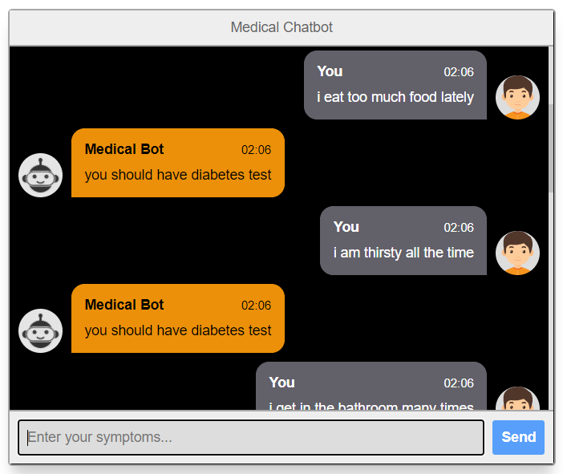
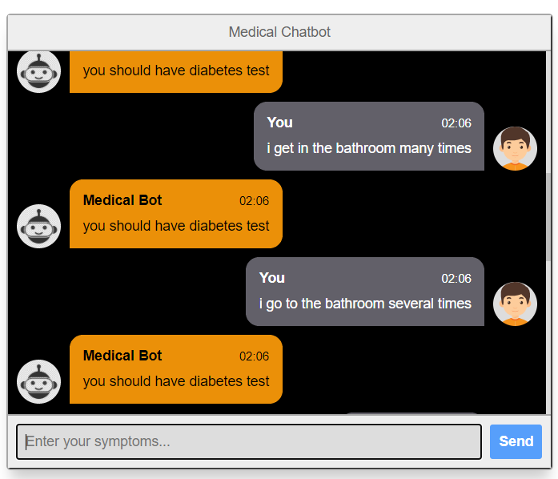
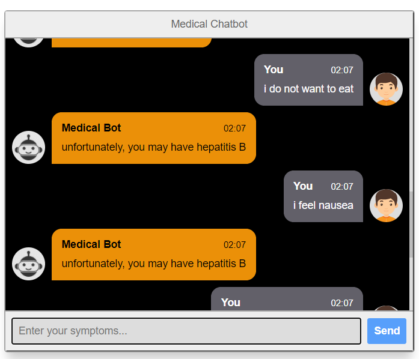
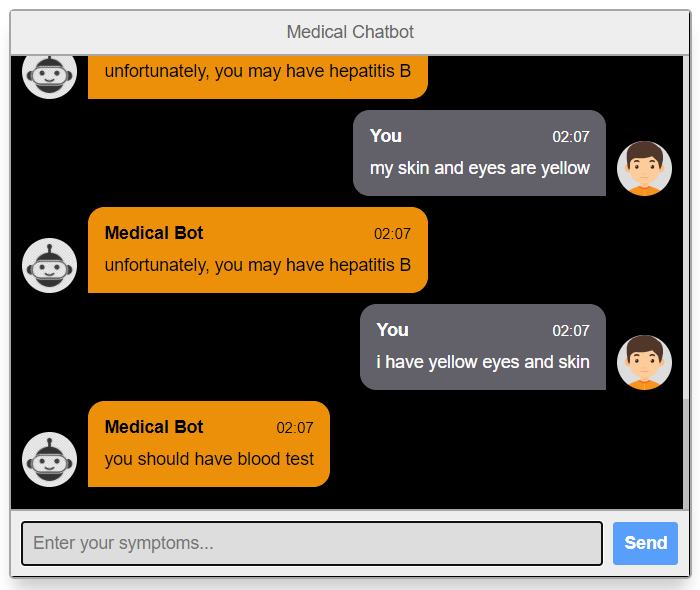
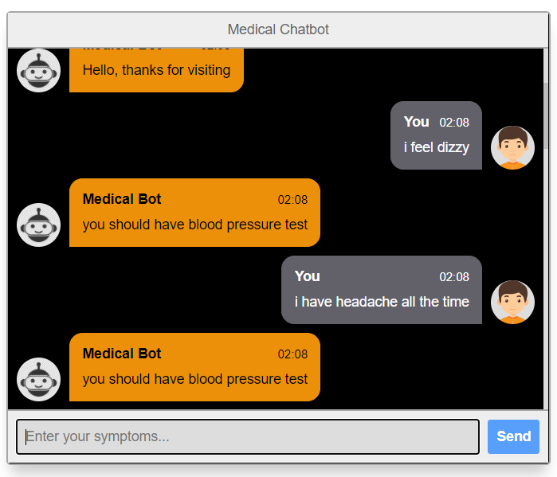
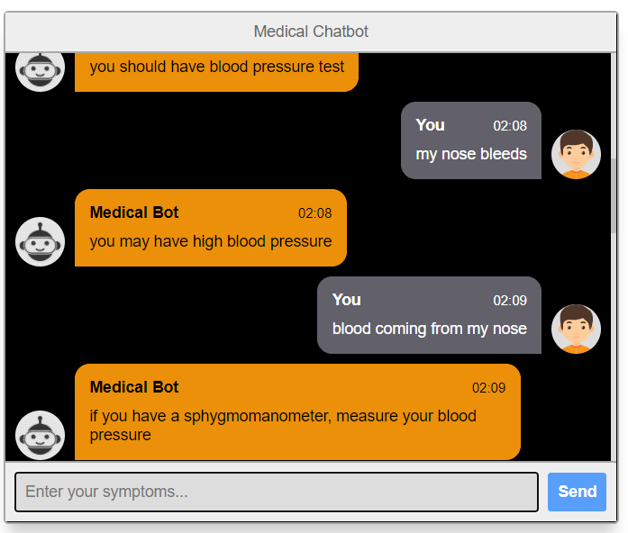
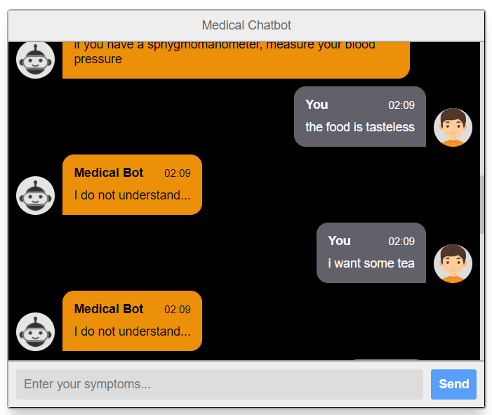
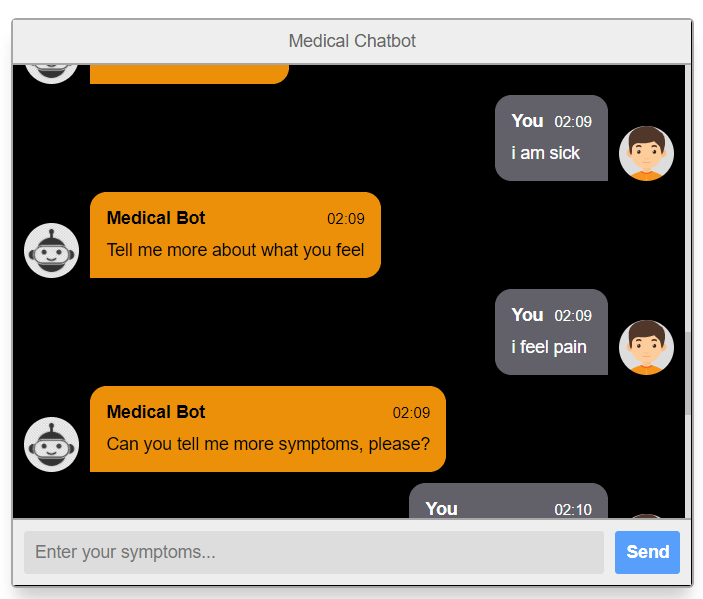

# &emsp;&emsp;**`Medical Chatbot For Diseases Diagnosis `**
# **`Team`** :
### 1- Galal Hossam &emsp;&emsp;&emsp;&emsp;2- Omar Abdelzaher
### 3- Gehad Mohammed &emsp;&emsp;&emsp;&emsp;4- Shaden Ahmed
### 5- Zeinab Walid &emsp;&emsp;&emsp;&emsp;6- Mohammed El-Sayed

# **`ABOUT`**
### We have implemented a Medical Chatbot to be used as AI doctor for patients through a web page interaction.

### We implement our gui as web page for chat interface and deal with this page as our client in client-server socket connection.

### We use python for all our implementation with HTML & Css for frontend of web page.

### Our data is a json file, which collected from different online data sets, and reform it for our neural network model.   

# **`Uploaded Files`**
### Our project is splitted for 3 parts of file  :
### *Note : All files have in-line comments that describe every step.*
## 1- NLP algorithm with data
### i) train.py -- To train our neuta network over the data in json file, and save parameters and the model.
### ii) model.py -- Contain the structure of our neural network.
### iii) nltk_utils.py -- For processing over all words before training.
### iv) intents.json -- The whole data set for different diseases and chat interaction.
### v) data.pth -- The saved model and parameters after training for prevent training every time.

## 2- Web page & Client
### i) app.py -- The main web page and its back end interaction, and the socket client connection to server.
### ii) index.html & style.css --  Maintain the front end page and its styles.

## 3- Socket connection & Server
### i) UDP_multithread_server.py -- The socket server implementation connected to nlp algorithm for the processing on client input.

# **`Test Cases`**
### Testing Diabetes disease:

- Sentences from the dataset  

  

- Sentence not included in the dataset

  

### Testing Hepatitis B disease:

- Sentences from the dataset  

  

- Sentence not included in the dataset

  

### Testing High Blood Pressure disease:

- Sentences from the dataset  

  

- Sentence not included in the dataset

  

### Testing strange cases:

### Asking for more symptoms:

# **`DEPENDENCIES`**
### For run this code you need to install {nltk: NLP library, torch: for uses the advantages of pytorch platform}, by using " pip install lib_name "

# **`HOW TO USE`**
### you must install all dependencies that is not included in your device and just run app.py by typing in terminal `python app.py` and open the URL than you get from terminal & in another terminal run the server by`python UDP_multithread_server.py` and then go ahead and use the medical bot.
